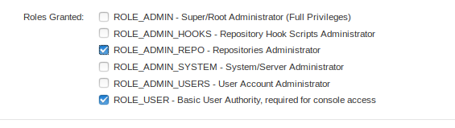
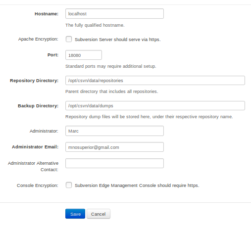

# Ejercicio 2

## Instalación de subversion

Instalamos el subversion con el docker

Ahora con el subversion instalado, vamos a nuestro local host y entraremos con admin admin

Activaremos el servidor

Crearemos un usuario

Con los permisos que necesitemos.

Crearemos el repositorio

Ahora cogeremos el checkout command que nos dan y lo ejecutaremos (en mi caso al no tener servidor DNS, pondré la IP directamente, ya que es de mi propia máquina)

