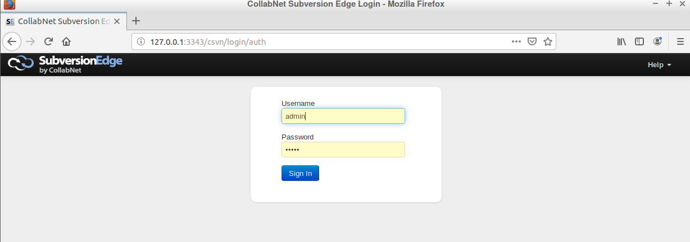
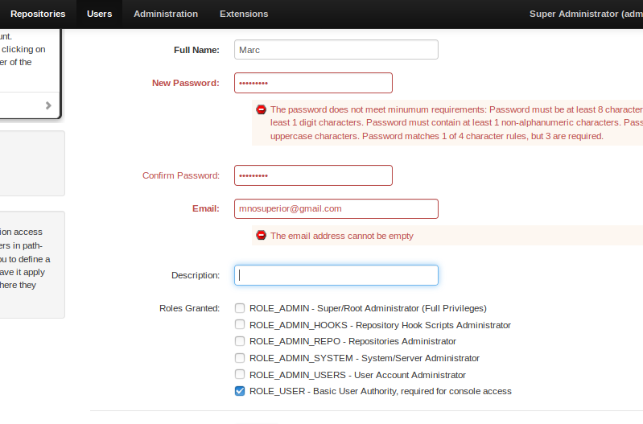

# Ejercicio 2

## Instalación de subversion

Instalamos el subversion con el docker

Ahora con el subversion instalado, vamos a nuestro local host y entraremos con admin admin

Activaremos el servidor

