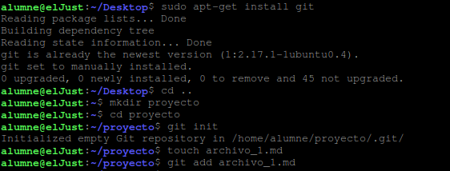
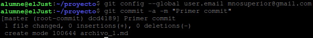
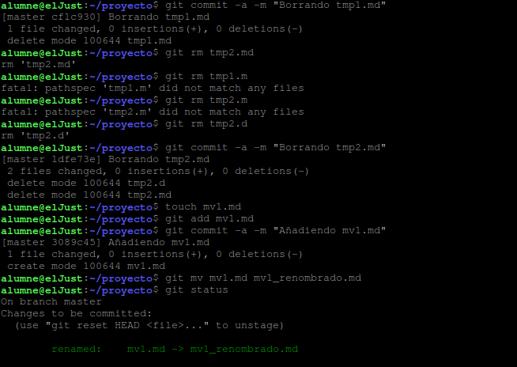
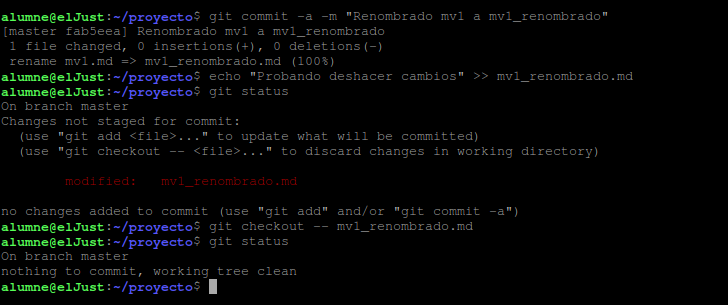

# Ejercicio 3
# Ejercicios GIT
Instalaremos el git, crearemos una carpeta la cual será el repositorio de nuestro git y allí lo iniciaremos.
Además crearemos un archivo el cual lo añadiremos a nuestro git

Ahora añadiremos un correo/nombre para que nos identifique y haremos nuestro primer commit

Crearemos 2 archivos más y veremos que nos pide añadirlos, como lo tenemos todo en el mismo sitio simplemente haremos git add .
Y haremos un commit en el cual confirmamos que los añadimos.

Eliminamos el primero y veremos que esta eliminado, para confirmarlo haremos otro commit y ya estaría eliminado.
Y haremos lo mismo con el otro archivo.
Ahora crearemos otro archivo, el cual renombraremos.
Creamos, hacemos el commit para confirmar la creación
Hacemos el comando para renombrarlo con mv

Y confirmamos que editamos el nombre.
Ahora le añadiremos un texto al archivo renombrado.
Y confirmaremos ese texto añadido con el checkout.

