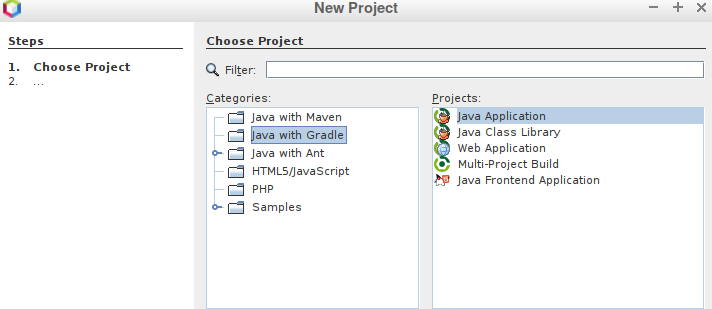
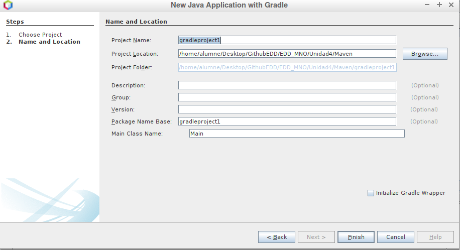
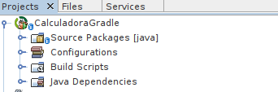

# Gradle
## Creando nuestro Gradle en NetBeans
### Crear un paquete Gradle
<p>Lo primero, necesitamos tener un NetBeans actualizado con la ultima versión ya que la característica de crear paquetes Maven, Ant o Gradle ha venido con las últimas y si descargas cualquier versión podría no tener esta característica<p>

<p>Para crear nuestro paquete Gradle seguiremos estos pasos<p>





<p> Y nos quedaria algo como esto <p>



### Programar el .java

<p> Finalmente, solo quedará acceder al .java que tenemos creado y programarlo como queramos, en nuestro caso, una calculadora <p>

```
public class calculadorgradle {
        static int suma(int a, int b){
            return a+b;
        }
        static int resta(int a, int b){
            return a-b;
        }
        static int multiplicacion(int a, int b){
            return a*b;
        }
        static int division(int a, int b){
            if (b==0){
                return b;
            }else{
                return a/b;
            }
        }
        static int mayorque(int a, int b){
            if (a>b){
                return a;
            }else{
                return b;
            }
        }
    public static void main(){
        int a,b;
        Scanner teclado = new Scanner(System.in);
        System.out.print("Dame un numero: ");
        a=teclado.nextInt();
        System.out.print("Dame otro: ");
        b=teclado.nextInt();
        System.out.println("La suma es: "+suma(a,b));
        System.out.println("La resta es: "+resta(a,b));
        System.out.println("La multiplicacion es: "+multiplicacion(a,b));
        System.out.println("La division es: "+division(a,b));
        System.out.println("El mayor es: "+mayorque(a,b));
    }
}
```