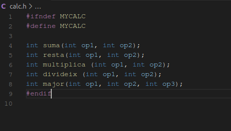
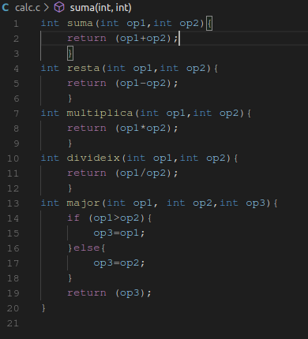
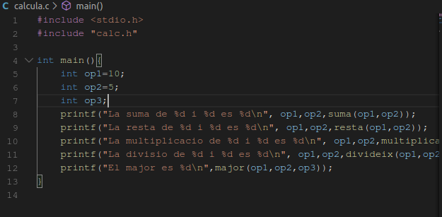
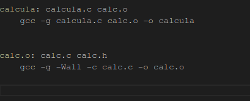
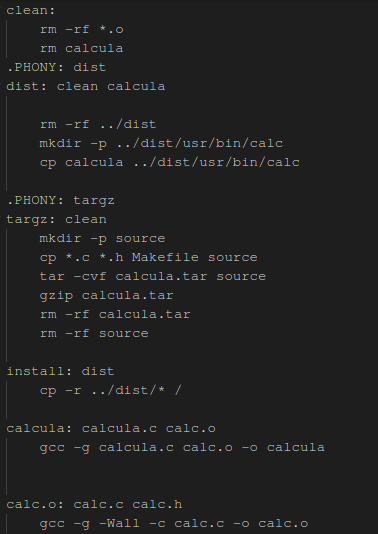

# MAKEFILE
## Creando los archivos necesarios
### Calc.h y calc.c
<p>Primero necesitaremos crear estos dos archivos para tener nuestra calculadora, uno trabajando como funciones y la otra con las operaciones. Pero para que funcionen tenemos que "unirlas" en un archivo objeto "calc.o"</p>





```c
gcc -c calc.c -o calc.o
```

### calcula.c

<p>Ahora crearemos el archivo que usara estas funciones</p>



<p>Y crearemos el objeto final uniendo las 3</p>

```c
gcc calc.o calcula.c -o calcula
```

### Markfile
<p>Después crearemos nuestro archivo de Markfile que nos realizará los anteriores comandos por nosotros indicandole que queremos que haga</p>



<p>Finalmente haremos las distribuciones</p>

